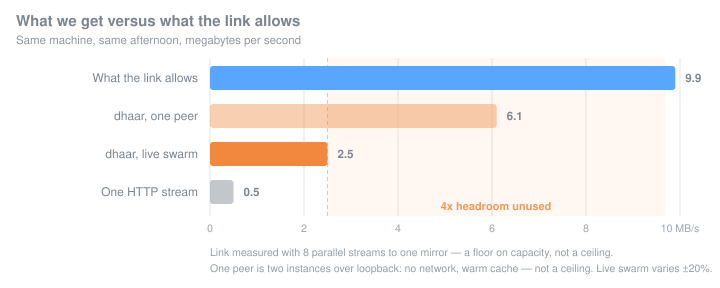

# Dhaar Torrent _(धार टॉरेंट)_

A torrent client written in Rust. Unserious. Built for fun.


## Status

~60% complete. Bencode codec, torrent file parsing, tracker announce, and the peer wire protocol are done. Downloading works end to end: peers are discovered over HTTP trackers, connections are handshaked and framed with a `tokio-util` codec, blocks are requested with pipelining (up to 8 outstanding requests per peer), completed pieces are SHA-1 verified and written to disk, and the finished download is split into its final file layout. The last piece of a torrent is short, and its block count, request lengths, hash check and disk reads are all sized to it rather than to the full piece length.

The tail of a download no longer stalls behind one slow peer: once every remaining piece is spoken for, the same blocks are requested from several peers at once and the losers are cancelled as soon as somebody else delivers. Finished pieces are announced to every connected peer with `Have`, and the tracker is told the real `uploaded`/`downloaded`/`left` figures along with `started` and `completed` events.

The whole thing is a library. `Download` owns the wiring, hands back a handle, and reports live status — bytes, rates, peers, pieces in flight, wasted bytes, hash failures — which is what the GUI above is rendering.

Connections keep themselves alive: a keep-alive goes out after 100s of silence, and one arriving resets the idle timer, which is why that timer is 150s — longer than the two minutes peers conventionally leave between keep-alives, so a peer with nothing to say is no longer dropped for saying nothing.

Peers can reach us now, not just the other way round. The peer manager binds a TCP listener on a port you pick (`--listening-port`, default 6881) and supervises accepted connections alongside dialled ones; that same port is what gets announced to the tracker. A download also survives a restart: the partial `.dhaar` store is read back on start and its verified pieces are kept, which is what lets an instance come up already seeding.

Still missing: web seeds, DHT, UDP trackers, and magnet links.

### Known rough edges

- **Trackers are the only peer source.** `announce` is optional and `announce-list` alone is enough, but a torrent that ships neither — Arch Linux's ISO torrent, for example, which carries only a BEP 19 `url-list` of web seeds — parses fine and then finds no peers at all. It logs a warning and sits idle.
- **A resumed store is invisible to the tracker.** Pieces recovered from disk set the progress counters but never pass through `piece_verified`, which is what `verified_bytes` counts. An instance that comes up complete therefore announces `left` as the full torrent length and never leaves the `Downloading` state, so trackers and peers read it as having nothing.
- **Inbound connections are uncapped.** The 50-connection limit is checked before dialling out, but nothing bounds how many connections we accept, and accepted peers now draw on the same budget — enough incoming can crowd out dialling entirely.
- **An inbound peer cannot be reconnected to.** A peer that dials us is known only by the ephemeral source port it called from, which nothing listens on. That address is deliberately not queued for retry, and the base protocol carries no way to learn the real one — that needs the BEP 10 extended handshake.
- **Torrents without a `creation date` are rejected.** The field is `Option`, but pairing `Option` with a `deserialize_with` and no `#[serde(default)]` makes serde require it anyway, so a perfectly valid file fails to parse.
- **A failed `accept()` spins.** The listener arm matches on `Ok(..)`, so an error falls through the pattern and the branch re-arms immediately; a persistent failure like running out of file descriptors becomes a busy loop.

### Testing

`cargo test` covers the codec and parsing. Behaviour that only shows up between
two processes has its own script:

```sh
scripts/test-inbound.sh          # --keep to retain the logs
```

It stands up a private tracker, builds a torrent and a pre-completed store, and
runs a seeder and a leecher against each other. The seeder announces into an
empty swarm so it has nobody to dial, which is what makes every byte that moves
proof that an accepted connection carried it.

### Benchmarks

```sh
cargo bench                      # divan; add a filter, e.g. cargo bench -- write_
```



The number that matters is how much of the link we actually use, so that is what
the client is measured against.

| | rate | how it was measured |
| --- | ---: | --- |
| What the link allows | 9.9 MB/s | 8 parallel HTTP range requests to an Ubuntu mirror |
| dhaar, own ceiling | 4.3 MB/s | seeder and leecher on one machine over loopback, 64 MiB |
| dhaar, live swarm | 2.5 MB/s | Ubuntu ISO, ~20 peers, varies ±20% between runs |
| One HTTP stream | 0.5 MB/s | single request to the same mirror |

**We use about a quarter of the bandwidth available.** Beating a single HTTP
stream 5x is BitTorrent working as intended — many peers outrunning one server —
but 2.5 against 9.9 is four times the throughput sitting unclaimed.

The loopback row is what rules out the network as the culprit. Two instances on
one machine, no latency, warm page cache, and it still stops at 4.3 MB/s. That
is the client's own ceiling, and it is *below* what the link offers, so the
bottleneck is our own bookkeeping rather than anything outside the process. It
works out to roughly 3.8 ms per 16 KiB block, spent on four actor round-trips
that all funnel through the single-task piece manager.

Two design decisions account for it. A peer may hold only one piece at a time,
which caps its outstanding requests at one piece's worth of blocks — sixteen
here — so per-peer throughput is `piece_length / RTT` no matter how many peers
connect. And every block costs those four round-trips through one task, which is
the same saturation that makes the piece-event broadcast overflow under load.

#### Component costs

None of these are the limit, which is the useful thing to know about them. They
are measured against the real `DiskPieceWriter` rather than a model of it, in a
release build, medians over 100 samples.

| what | median | throughput |
| --- | ---: | ---: |
| `read_block` | 10.97 µs | 1.49 GB/s |
| `write_block` | 15.29 µs | 1.07 GB/s |
| `set_bitfield` | 10.48 µs | — |
| `hash_piece` | 222.7 µs | 1.18 GB/s |
| `write_whole_piece` | 320.9 µs | 817 MB/s |

Storage runs some three hundred times faster than the client can fill it, so
tuning it further buys nothing. Distributions matter more than averages here:
`read_block` has a median of 11 µs and a worst case of 1.4 ms, because most
reads are served from the page cache and the occasional one is a real seek. That
spread is why the read path stays on a blocking thread pool.

A microbenchmark only ever says a *function* got faster. Whether a *download*
got faster is a separate question with a separate answer — the disk path here
once got 2.8x faster while download speed did not move at all. Benchmark
figures also shift about 2x with background load, so re-run on a quiet machine
before reading anything into a difference.

### Architecture

Components are independent tokio tasks talking over mpsc channels:

- **`Download`** — assembles every actor and their channels, spawns them, and hands back a `DownloadHandle` for status and shutdown
- **`peer_explorer`** — owns peer sources (currently `TrackerManager` over HTTP) and streams discovered peers out
- **`peer_manager`** — pulls peers through a selection strategy, caps concurrency at 50 connections, stops dialling once every piece is verified, and supervises the connection tasks directly: a task that panics or is dropped reports nothing, so its ending is observed rather than announced
- **`peer_connection`** — TCP connect, handshake, bitfield exchange, then hands the framed stream to `request_manager`
- **`request_manager`** — per-peer state machine (choke/interest, pipelined block requests, idle/request timeouts, cancels and `Have` announcements)
- **`piece_manager`** — the sole arbiter of who downloads what: it picks a peer's piece, registers its blocks and reports back in a single message, so two peers cannot claim the same work in the gap between asking and taking. Also SHA-1 verification and writes via a `PieceWriter` trait (`DiskPieceWriter` is the disk impl)
- **`status`** — atomics for the counters that move too often to be worth a message, and a `watch` of piece progress the piece manager builds in one turn of its loop

Workspace crates: [`crates/bencode`](crates/bencode) (serde codec) and [`crates/dhaar-gui`](crates/dhaar-gui) (the reference client).

### TODO

- [x] CLI args and config parsing (clap + TOML with merge)
- [x] Bencode deserializer (serde-based: integers, strings, bytes, lists, dicts, `Raw<T>`)
- [x] Bencode serializer (serde-based: integers, strings, bytes, lists, dicts)
- [x] Torrent file parsing (single and multi-file structs, raw `info` capture via serde)
- [x] Info hash computation (SHA-1 of bencoded `info` dict; hex and URL-safe forms)
- [x] Chrono datetime support in bencode (unix timestamp serde)
- [x] Logging/tracing — `tracing` + `tracing-subscriber` with env-filter
- [x] Tracker announce — HTTP GET request, URL rotation, retry with backoff
- [x] Tracker response — support binary model peers (6-byte entries)
- [x] Peer wire protocol — TCP handshake, choke/unchoke, interested, have, bitfield, request/piece/cancel/port messages
- [x] Piece manager — piece indices, bitfield tracking, atomic cross-peer piece and block claiming, SHA-1 verification
- [x] Request manager — per-peer connection state machine, pulled out of `peer_connection`
- [x] Connection timeouts — handshake/bitfield timeouts, 60s idle timeout, 30s outstanding-request timeout
- [x] Request pipelining — up to 8 outstanding block requests per peer
- [x] Disk I/O — verified pieces written to a sparse `<name>.dhaar` temp file, split into final files on completion
- [x] `lib.rs` for library API
- [x] Endgame mode — once only a few blocks remain, request them from every peer at once and `Cancel` the losers, so one slow peer can no longer hold the tail for a full 30s request timeout
- [x] Completion state — stop dialing peers once every piece is verified
- [x] Tracker reporting — real `uploaded`/`downloaded`/`left` and `started`/`completed` events
- [x] `Download` wrapper struct — pull the wiring out of `main.rs`
- [x] Status/progress — live counters and a sampled `DownloadStatus` feed, instead of the internals being silent
- [x] GUI client — iced, with a file picker and several downloads at once
- [x] Periodic keep-alive messages — sent into silence only, and inbound ones no longer swallowed by the decoder
- [x] Supervise connection tasks — the peer manager watches the tasks rather than waiting to be told, so a panic no longer leaks the slot
- [ ] `stopped` tracker event on shutdown
- [ ] Count resumed pieces as verified, so `left` and the seeding state are right after a restart
- [ ] Cap inbound connections, and reserve part of the budget so incoming cannot starve dialling
- [ ] Identify peers by `peer_id` — mutual dials currently make two connections to one client
- [ ] Handle `accept()` errors instead of letting the `select!` arm re-arm on failure
- [x] Inbound connections — TCP listener on a configurable port, accepted connections supervised alongside dialled ones
- [ ] Web seeds (BEP 19) — HTTP `url-list` sources for trackerless torrents
- [x] Resume support — recover already-downloaded pieces from a partial `.dhaar` file on restart
- [ ] Per-peer status — the library aggregates today and keeps no peer registry
- [ ] Pause and resume a running download
- [ ] Skip announce URLs we cannot speak — `udp://` and `wss://` go to the HTTP client and fail forever (144 warnings in 90s on a WebTorrent-made torrent)
- [ ] Announce `completed` when the download finishes, rather than at the next scheduled announce
- [ ] Tracker communication — UDP tracker (BEP 15)
- [ ] DHT (BEP 5) — decentralized peer discovery
- [ ] Magnet links (BEP 9/10) — metadata exchange
- [x] Seeding — `finalize` copies rather than moves, so the `.dhaar` store outlives completion and blocks can still be read out of it
- [ ] Message Stream Encryption (BEP 8) — WebTorrent opens encrypted handshakes by default, so its outgoing connections cannot talk to us at all
- [ ] Rate limiting
- [ ] `models/` module — shared domain types

## Usage

### GUI

```sh
cargo run -p dhaar-gui
```

Press **Add torrent** to choose a `.torrent` file, and add as many as you like. Paths given on the command line start immediately. See [`crates/dhaar-gui`](crates/dhaar-gui) for what it does and does not do.

### CLI

```sh
dhaar-torrent <torrent_file> [OPTIONS]
```

| Flag                       | Description                                                          |
| -------------------------- | -------------------------------------------------------------------- |
| `-c, --config-file <PATH>` | Path to config file (default: `~/.config/dhaar-torrent/config.toml`) |

```sh
dhaar-torrent ubuntu.torrent
dhaar-torrent ubuntu.torrent --config-file ./my-config.toml
```

Progress is logged once a second.

### Library

```rust
use dhaar_torrent::Download;
use std::path::Path;

let download = Download::from_torrent_file(Path::new("ubuntu.torrent"))?;
let mut updates = download.subscribe();  // taken before starting, so nothing is missed

// Held for as long as the download should live: dropping it stops the download.
let _handle = download.spawn();          // returns immediately

while updates.changed().await.is_ok() {
    println!("{:.1}%", updates.borrow().progress() * 100.0);
}
```

Downloads land in the current working directory. While in flight the data lives in a single `<name>.dhaar` file; once every piece verifies, it is split into the torrent's real file layout.

Set `RUST_LOG` to control log output:

```sh
RUST_LOG=dhaar_torrent=debug dhaar-torrent ubuntu.torrent
```

## Config

Config file lives at `~/.config/dhaar-torrent/config.toml` by default. TOML format. Nothing configurable there yet — every knob is still a CLI flag.

## Build

```sh
cargo build --release
```

Requires Rust (stable, edition 2024).

## License

[MIT](LICENSE) — Piyush Raj
